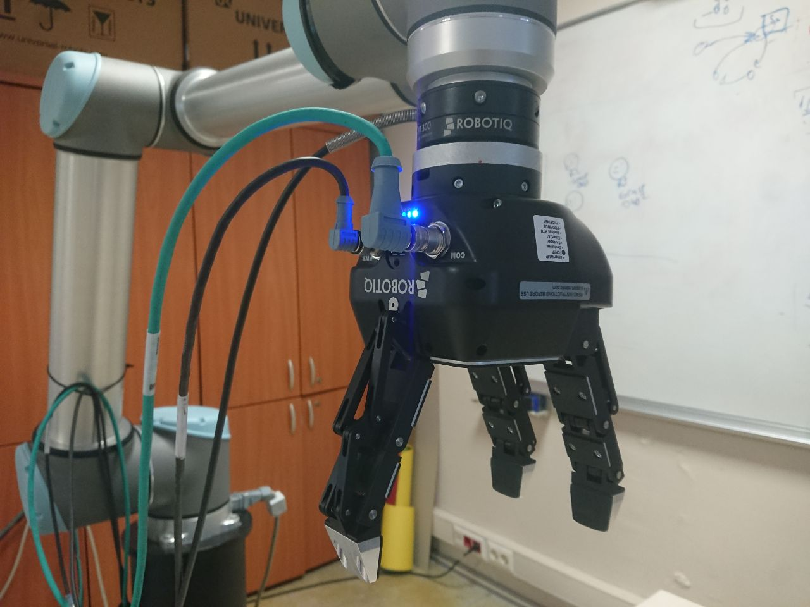
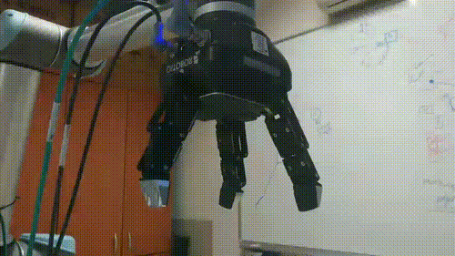

# Gripper3F_interface
**Gripper3F Robot interface for controlling the robotic gripper with ROS**
## Description 
This repo allows you to control easily the Gripper3F from your computer with ROS, sending commands (open, close) and changing gripping modes.
Also, is possible to set up the force, speed, and the precise position to go. 

it's designer to work at the best with the [UR10 robot interface](https://github.com/igor-lirussi/UR10_robot_interface)

### Topics:
- Robotics
- Gripper

## Result




## Requirements & Dependencies
- ROS 
- rospy and numpy
- https://github.com/ros-industrial/robotiq build in your system with catkin
- https://github.com/Nishida-Lab/robotiq_3f_ros_pkg build in your system with catkin


## Install 
*   clone in your project
*   remember to source the setup.bash of catkin
*   run the node
*   use the interface as in the "Run" section

## Run
```python
from gripper3f_interface import Gripper
import rospy

rospy.init_node("gripper")
rospy.sleep(1.0)
gripper = Gripper()
gripper.activate_gripper()

gripper.close_gripper()
```

## Useful Resources & Extra
- https://github.com/ros-industrial/robotiq
- https://github.com/Nishida-Lab/robotiq_3f_ros_pkg

## Authors
* **Igor Lirussi** @ BOUN Boğaziçi University - CoLoRs (Cognitive Learning and Robotics) Lab

## Acknowledgments
*   All the people that contributed with suggestions and tips.

## License
This project is licensed - see the [LICENSE](LICENSE) file for details.
